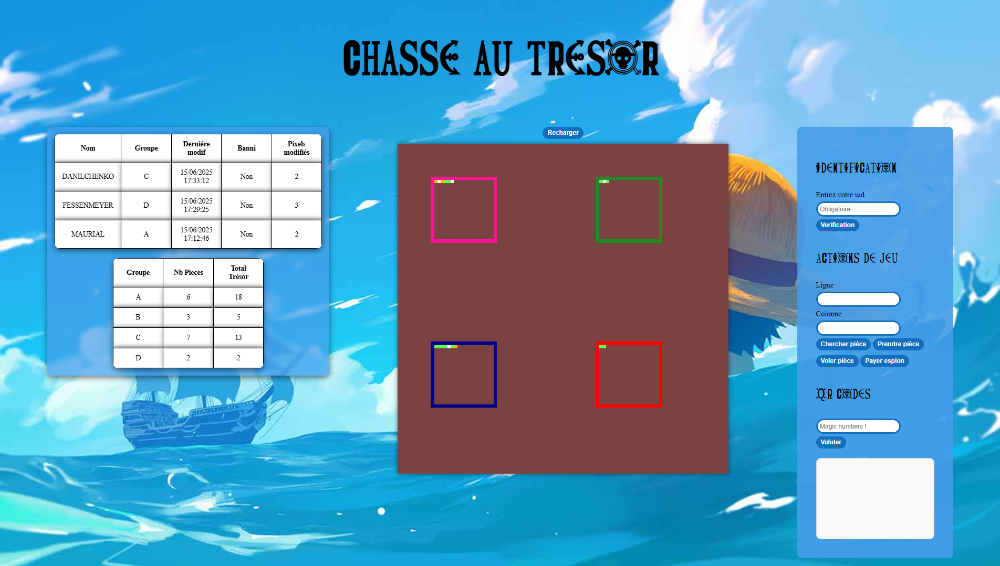

# Chasse au trésor collaborative
# Auteur : Marquet Killian 
## Fonctionnalités

- ### Affichage : 
        - Plateau de jeu
        - Liste des joueurs 
    Automatiquement tenus a jour toutes les 5 secondes

- ### Identification des joueurs : 
        - Vérification de l'uid saisie par le joueur

- ### Actions disponibles : 
        - Chercher pièce 
        - Prendre pièce 
        - Voler une pièce 
        - Payer un espion

## Nouvelles fonctionnalités ajoutées
        - Systeme de cliques pour avoir la position des pièces (Juste en faisant un clique gauche sur une piece sur le plateau)
        - Interface moderne 
        - Affichage de la liste des groupes et de leurs trésorerie
        - Magic numbers

## Structure des fichiers

- `index.html` : structure HTML principale du jeu.
- `style.css` : design et mise en page.
- `evenements.js` : gestion des événements (clics, saisies, etc)
- `fonctions.js` : contient les fonctions de communication avec le serveur
- `tableaux.js` : récupère les données du plateau, des joueurs et des groupes
- `affichages.js`: gère l’affichage des tableaux

---

## Technologies utilisées

- HTML / CSS
- JavaScript
- API Fetch
## Documentation de l'api : 
```bash
https://pixel-api.codenestedu.fr/api-docs/
```
## Rendu final

